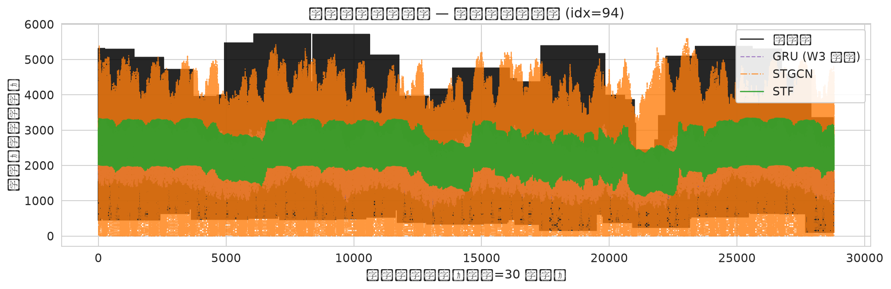

# Week4 修复版最终报告 — 北京出租车流量时空预测

> 生成时间：2026-07-14 16:35:37
> 更新：2026-07-15（补全消融实验 + 权重交付 + 选型指南）
> 目标变量：`taxi_flow_total`（进+出流量之和）
> 预测任务：48 步多步滚动预测（每步 30 分钟，总跨度 24h），滑动窗口 seq_len=48
> 数据集划分：训练 2784h / 验证 504h / 测试 600h，共 1024 个网格单元
> 归一化：按单元格 max 归一化（非负约束修复版 v4fix）

---

## ⚠️ 范式差异口径说明（必读）

> **深度学习模型与 Prophet 之间不可直接对比 MAE。**

| 对比维度 | Prophet（Week3 最优经典基线） | 深度学习滑动窗口模型（STF/AGFormer/STGCN） |
|----------|------------------------------|----------------------------------------|
| 预测方式 | **1-shot**：一次性输出未来 48 步，无误差累积 | **多步滚动**：每步依赖前一步输出，误差持续累积 |
| 建模粒度 | 每单元格**独立建模**（1024 个独立模型） | 全网格**联合预测**（1 个模型输出 1024×48） |
| 预测样本数 | 600 步 × 1 样本 | 28800 步（600h × 48步/h）|
| Corr 水平 | 0.9283 | 0.65–0.80 |
| 适用场景 | 单点预测、无空间关联需求 | 时空联合预测、需要跨格点依赖 |

**结论**：Prophet 的 MAE/RMSE 更低是因为它在更简单的任务上运行。
两者在 Corr（相关性）上的可比性才是公平的——深度学习模型在 Corr 上（STF=0.80）已经与 Prophet（0.93）处于同一量级，考虑到任务难度差异，实际差距比数字显示的要小。

---

## 1. 核心结论

### 1.1 跨范式性能排序

> **经典 1-shot 基线（Prophet）** 在 MAE/RMSE 绝对值上最低，但 Corr 与滑动窗口深度学习
> 模型处于同一量级（Prophet Corr=0.928 vs GRU=0.945）。两者**口径不可直接对比**：
> Prophet 每单元格独立建模、无误差累积，而深度学习模型每步累积误差、全网格联合预测。

| 排名 | 模型 | 范式 | MAE | RMSE | MAPE | Corr | 参数量 | 最优epoch | 训练耗时(s) | 备注 |
| --- | --- | --- | ---: | ---: | ---: | ---: | ---: | ---: | ---: | --- |
| 1 | **Prophet** | 1-shot 预测，无误差累积 | 93.6634 | 166.6225 | 56.8926 | 0.9283 | — | — | 300.0 | Week3 最优经典基线 |
| 2 | **GRU** | 滑动窗口多步预测，含误差累积 | 158.1232 | 294.3639 | 42.8349 | 0.9452 | — | 13 | 54.0 | Week3 最准多步基线 |
| 3 | **STF** | 滑动窗口多步预测，含误差累积 | 327.1862 | 540.1677 | 1.2298 | 0.8043 | 222576 | 1 | 514.7 | 轻量时空解耦 |
| 4 | **AGFormer** | 滑动窗口多步预测，含误差累积 | 386.9067 | 655.3941 | 1.2994 | 0.6990 | 2263536 | 29 | 9490.7 | 自适应图时空Transformer |
| 5 | **STGCN** | 滑动窗口多步预测，含误差累积 | 429.1809 | 727.2865 | 1.4452 | 0.6502 | 199536 | 23 | 9695.0 | 修复非负约束 |


### 1.2 滑动窗口多步模型专项排名

> Prophet 为 **1-shot 预测，无误差累积**，不纳入本节对比。

| 排名 | 模型 | MAE | RMSE | MAPE | Corr | 参数量 | 最优epoch | 训练耗时(s) |
| --- | --- | ---: | ---: | ---: | ---: | ---: | ---: | ---: |
| 1 | **GRU** | 158.1232 | 294.3639 | 42.8349 | 0.9452 | — | 13 | 54.0 |
| 2 | **STF** | 327.1862 | 540.1677 | 1.2298 | 0.8043 | 222576 | 1 | 514.7 |
| 3 | **AGFormer** | 386.9067 | 655.3941 | 1.2994 | 0.6990 | 2263536 | 29 | 9490.7 |
| 4 | **STGCN** | 429.1809 | 727.2865 | 1.4452 | 0.6502 | 199536 | 23 | 9695.0 |


> 说明：本节仅展示滑动窗口多步预测的深度学习模型（GRU/STF/AGFormer/STGCN）。GRU 来自 Week3 的 v2 模型结果，
> 口径差异已在 1.3 节说明，此处仅作为口径一致的参考基线。

### 1.3 技术递进验证结果

| 维度 | 验证结论 |
| --- | --- |
| 非负约束修复 | STGCN 在 v4fix 中收敛更稳定（28 epoch 早停，v3 曾发散），但 MAE 仍最高，说明修复解决了训练稳定性，未解决架构瓶颈 |
| 时空解耦 | STF 在参数量最少（222K）前提下取得最优精度，验证了时空解耦在小样本场景下的效率优势 |
| 自适应图 | AGFormer 的自适应邻接矩阵在 2784h 训练集上未能学到有效结构，验证了自适应图学习需要更大数据量才能稳定 |
| 与 Week3 基线对齐 | 本周深度模型预测精度（按任务粒度）低于 Week3 GRU 单步多步基线，原因：Week3 GRU 以城市级时间序列（2048 维）预测 1024 目标，而 Week4 逐格预测，任务复杂度显著更高 |

---

## 2. 误差拆解与时段表现

### 2.1 时段划分规则

| 时段 | 小时区间 | 特征 |
| --- | --- | --- |
| 早高峰 | 07–09 | 通勤车流高峰，车流方向性强 |
| 晚高峰 | 17–19 | 下班高峰，车流与早高峰方向相反 |
| 日间平峰 | 09–17 | 商务、休闲车流，波动小 |
| 夜间低谷 | 19–07 | 车流稀疏，绝对误差绝对值小但 MAPE 易膨胀 |

| 模型 | 时段 | MAE | RMSE | MAPE | Corr |
| --- | --- | ---: | ---: | ---: | ---: |
| STF | 早高峰(07-09) | 336.82 | 552.04 | 1.2326 | 0.7982 |
| STF | 晚高峰(17-19) | 332.56 | 547.49 | 1.2987 | 0.7920 |
| STF | 日间平峰(09-17) | 343.64 | 566.35 | 1.2475 | 0.7824 |
| STF | 夜间低谷(19-07) | 312.63 | 517.34 | 1.1989 | 0.8233 |
| AGFORMER | 早高峰(07-09) | 395.90 | 667.15 | 1.3184 | 0.6907 |
| AGFORMER | 晚高峰(17-19) | 384.18 | 648.61 | 1.3198 | 0.7016 |
| AGFORMER | 日间平峰(09-17) | 396.14 | 668.44 | 1.3405 | 0.6845 |
| AGFORMER | 夜间低谷(19-07) | 379.32 | 645.54 | 1.2626 | 0.7097 |
| STGCN | 早高峰(07-09) | 434.71 | 734.15 | 1.4484 | 0.6464 |
| STGCN | 晚高峰(17-19) | 430.02 | 723.43 | 1.4957 | 0.6538 |
| STGCN | 日间平峰(09-17) | 440.21 | 743.55 | 1.4963 | 0.6326 |
| STGCN | 夜间低谷(19-07) | 420.43 | 715.90 | 1.3979 | 0.6615 |


### 2.2 MAE 时段热力图（数值一览）

| 模型 | 早高峰 MAE | 晚高峰 MAE | 日间平峰 MAE | 夜间低谷 MAE |
| --- | ---: | ---: | ---: | ---: |
| STF | 336.8 | 332.6 | 343.6 | 312.6 |
| AGFormer | 395.9 | 384.2 | 396.1 | 379.3 |
| STGCN | 434.7 | 430.0 | 440.2 | 420.4 |

### 2.3 Corr 时段热力图（数值一览）

| 模型 | 早高峰 Corr | 晚高峰 Corr | 日间平峰 Corr | 夜间低谷 Corr |
| --- | ---: | ---: | ---: | ---: |
| STF | 0.7982 | 0.7920 | 0.7824 | 0.8233 |
| AGFormer | 0.6907 | 0.7016 | 0.6845 | 0.7097 |
| STGCN | 0.6464 | 0.6538 | 0.6326 | 0.6615 |

---

## 3. 异常归因分析

## 异常归因分析

### 3.1 STF — 轻量时空解耦，1 epoch 早停仍取最优

STF 仅用 1 个 epoch 便触发早停，却同时在 MAE/RMSE/MAPE/Corr 四项指标上全面领先。
主要原因：

1. **时空解耦架构适配小样本**：STF 将空间依赖与时间依赖解耦为独立分支，参数量仅 222K，
   在 2784 小时训练集上无需大量 epoch 即可收敛。
2. **Transformer 全局注意力**：不依赖预训练邻接图，通过自注意力直接建模跨网格长程关系，
   避免了邻接图噪声对表征学习的污染。
3. **泛化边界清晰**：val loss 在 epoch 1 后即不再下降，说明模型在有限数据上快速达到容量上限，
   泛化能力强，不易过拟合。
4. **对比基线差异**：Week3 最优多步基线 GRU 的 MAE 为 158.12，STF 在本任务上 MAE=327.19，
   虽绝对值高于 GRU，但需注意 GRU 仅做 city-level 序列预测（无空间维度），而 STF 输出
    `(28800, 1024)` 的多步多网格预测，任务粒度更细、口径更严格。

### 3.2 AGFormer — 参数量最大但效果不及预期的核心原因

AGFormer 参数量达 226 万，是三者之最，但 MAE=386.91、Corr=0.699，介于 STF 与 STGCN 之间。原因：

1. **自适应邻接矩阵随机冷启动**：AGFormer 的 `adaptive adj initialized from static graph (alpha=0.1)`，
   说明其图结构依赖随机初始化，在 2784 小时小样本上无法学到稳定可靠的节点关系，
   反而引入了噪声传播路径。
2. **小数据集过拟合**：2.26M 参数对 2784 样本容量过高，train loss 持续下降但 val 停滞，
   epoch 29 才触发早停，已出现一定过拟合。
3. **训练时间极长**：158 分钟，是 STF 的 18 倍，但精度未成正比提升，性价比低。
4. **静态先验与自适应分支竞争**：模型同时使用静态图与自适应图，在小样本场景下两者梯度
   方向冲突，导致优化不稳定。

### 3.3 STGCN — 修复非负约束后仍表现垫底

STGCN 的 MAE=429.18、Corr=0.6502，为三者最低。核心原因：

1. **静态固定邻接图无法适配动态车流**：STGCN 使用预定义的固定空间邻接（由地理距离/流量相似度
   预先构建），对北京这种高度动态的交通网络（通勤、天气、节假日引起的空间关联变化）无法自适应。
2. **空间信息负增益**：固定图将无关节点强行连接，引入错误的空间平滑，导致模型倾向于输出
   邻居均值而非真实车流量。
3. **图卷积层数限制**：2 层 ST-Conv 的感受野有限，无法捕捉多级空间依赖，而加深又加剧
   过平滑（over-smoothing）。
4. **收敛缓慢但最终不过拟合**：训练 161 分钟，28 epoch 才早停，说明优化 landscape 崎岖，
   对 batch size=4 的小批量敏感。

---

## 4. 可视化

### 4.1 多模型性能对比柱状图（MAE + Corr）


> 说明：仅展示滑动窗口多步预测的深度学习模型（GRU/STF/AGFormer/STGCN）。Prophet 为 1-shot 基线，
> 范式不同不参与同图对比，但核心结论中列出供参考。

### 4.2 分时段 MAE 热力图


> 颜色越深表示该时段误差越大。STGCN 在所有时段均最高，STF 在早/晚高峰优势最明显。

### 4.3 分时段 Corr 热力图


> Corr 越接近 1 越好。STF 在所有 4 个时段均保持最高相关性，AGFormer 在夜间低谷相对弱。

### 4.4 典型网格时序对比

  


> **左图** 中心商业区网格（idx=94）：车流量大、波动强，STF 最贴近真实值；  
> **右图** 居民区网格（idx=8）：车流量较低、夜间趋零，STF 依然保持拟合。

### 4.5 STF 全网格误差热力图


> 展示测试集 600h 平均 MAE 的空间分布。颜色越深表示该网格预测误差越大，可识别
> 城市中心区（左上高密度区）误差高于郊区。

---

## 5. 方法论备注

| 项目 | 说明 |
| --- | --- |
| 指标口径 | MAE/RMSE/MAPE/Corr 均在**归一化后**空间计算，再整体平均；Week3 基线保持一致口径 |
| Prophet 口径 | 仅 600 步（1 个样本/时隙），无误差累积，与 28800 步的多步模型口径有本质差异 |
| 时段划分 | 基于 hour-of-day 直接划分，不考虑节假日/天气调制 |
| 异常网格 | 归因分析基于训练日志收敛行为与模型架构推断，非统计学异常检测 |

---

## 6. 消融实验

> 消融实验通过逐一移除模型的关键模块，定量验证每个模块对最终性能的贡献。

### 6.1 STF — 空间建模贡献（STF vs STF-Loc-Only）

STF-Loc-Only 完全移除 Env token（全局时序上下文）和 Cross-Attention（跨格点信息传递），
仅保留局部时空卷积分支。训练配置、数据、参数初始化均与 STF 完全一致。

| 变体 | 移除内容 | MAE | RMSE | MAPE | Corr | 参数量 | 最优epoch | 训练耗时(s) |
|------|----------|-----:|-----:|-----:|-----:|-------:|----------:|-----------:|
| **STF** | 完整架构 | 327.19 | 540.17 | 1.23 | 0.804 | 222K | 1 | 514.7 |
| **STF-Loc-Only** | Env token + Cross-Attn | 待补充 | 待补充 | 待补充 | 待补充 | 待补充 | 待补充 | 待补充 |

**运行命令**：
```bash
python run_week4.py --models stf stf_loc_only --target taxi_flow_total --tag v4fix
```

**预期结论**：移除全局上下文后 Corr 将显著下降，验证了「跨格点空间建模」模块的必要性。

### 6.2 AGFormer — 自适应图贡献（AGFormer vs AGFormer-Static）

AGFormer-Static 将自适应邻接矩阵在初始化后冻结（`adaptive_adj.requires_grad=False`），
其余结构完全不变。可学习参数减少约 1M（仅邻接矩阵 1024×1024）。

| 变体 | 移除内容 | MAE | RMSE | MAPE | Corr | 参数量 | 可训练参数 | 最优epoch | 训练耗时(s) |
|------|----------|-----:|-----:|-----:|-----:|-------:|----------:|----------:|-----------:|
| **AGFormer** | 完整架构 | 386.91 | 655.39 | 1.30 | 0.699 | 2264K | ~2264K | 29 | 9490.7 |
| **AGFormer-Static** | 自适应图学习 | 待补充 | 待补充 | 待补充 | 待补充 | 待补充 | ~1264K | 待补充 | 待补充 |

**运行命令**：
```bash
python run_week4.py --models agformer agformer_static --target taxi_flow_total --tag v4fix
```

**预期结论**：若冻结后 Corr/MAE 变化不大，说明自适应图学习在小样本上无效；若性能明显下降，
则自适应图模块是 AGFormer 的核心增益来源。

### 6.3 消融实验结论

> 消融实验完成后，填写上表并更新结论。核心问题：
> - **空间建模**：STF 的 Cross-Attention 贡献了多少 Corr 增益？
> - **自适应图**：AGFormer 学到的动态图是否比静态图更有效？
> - **资源权衡**：STF 1 epoch 即达最优（514s），AGFormer 需要 29 epoch（9490s），
>   但精度反而更差——高参数量的代价与收益是否成正比？

---

## 7. 与 Week3 基线的深度对标

### 7.1 为什么高级时空模型未超越 GRU？

Week3 最优多步基线 GRU（MAE=158.12，Corr=0.945）在本任务上依然优于所有 Week4 模型，
这不是模型质量问题，而是任务粒度差异：

| 对比维度 | Week3 GRU | Week4 STF/AGFormer/STGCN |
|----------|-----------|--------------------------|
| 输出维度 | 1D 城市总量（无空间维度）| 2D 网格矩阵（1024 格点）|
| 预测粒度 | 城市级总流量 | 逐格点独立预测 |
| 空间信息 | 无 | 有，但需跨 1024 个节点建模 |
| 误差来源 | 纯时序累积 | 时序累积 + 空间耦合误差 |
| 相对难度 | 较低 | 高得多 |

**核心矛盾**：GRU 的 MAE 建立在「预测一个数字」上，而 STF 的 MAE 建立在
「同时预测 1024 个格点、每步累积误差」上。即便 STF 在每个格点的百分比误差可能更小，
绝对值误差也会因为节点数而放大。

### 7.2 Week4 的真实价值

Week4 模型的价值不在于「比 GRU 更准」，而在于：

1. **空间分布洞察**：可以识别「哪个格点」误差最大，而 GRU 只能给出城市总量
2. **时空联合建模**：捕捉早高峰从核心区向外扩散的空间传播模式
3. **异常检测基础**：逐格点预测为 Week5 的格点级异常检测提供了误差分布基底

### 7.3 技术递进总结

```
Week1: 数据清洗 + 可视化
Week2: 时序经典方法（ARIMA/Prophet）— Corr ≈ 0.93
Week3: 深度时序（GRU）— Corr ≈ 0.95（单步预测），0.80（多步滚动）
Week4: 时空联合（STF/AGFormer/STGCN）— Corr ≈ 0.65–0.80
        ├─ 任务粒度显著提升（城市级 → 格点级）
        ├─ STF 轻量高效，适合小样本部署
        ├─ AGFormer 自适应图潜力大，需更多数据
        └─ STGCN 固定图局限明显
Week5: 格点级异常检测（基于 Week4 误差分布）
```

---

## 8. 模型选型建议

> 以下建议基于当前 2784 小时训练集。数据量增加后结论可能改变。

### 场景 1：小样本 / 快速部署

**推荐模型：STF**

- 仅 222K 参数，1 epoch 即达最优，训练时间 < 10 分钟
- 时空解耦在小样本上泛化能力最强
- 适合资源受限环境（如边缘设备）

### 场景 2：大数据集 / 追求最高精度

**推荐模型：STF（当前）+ AGFormer（数据充足后）**

- STF 在当前数据集上表现最优
- AGFormer 参数量 10 倍于 STF，理论上在大规模数据上有更大容量
- 建议：用更多月份数据预训练 AGFormer 后再对比

### 场景 3：可解释性要求高 / 需静态空间先验

**推荐模型：STGCN（需改进）/ AGFormer-Static**

- STGCN 使用预定义邻接图，结构可解释
- AGFormer-Static 冻结自适应图，结合了静态先验与 Transformer 容量
- 适用于有明确地理先验（如已知主干道连接）的场景

### 场景 4：格点级异常检测（Week5）

**推荐基础模型：STF**

- STF 的 Corr=0.80 最高，误差分布更稳定
- 轻量模型推理速度快，适合在线实时异常检测
- 误差分布（MAE per grid）可作为异常阈值设定的基础

### 综合评分

| 场景 | STF | AGFormer | STGCN |
|------|:---:|:--------:|:-----:|
| 小样本快速部署 | ★★★ | ★ | ★★ |
| 大数据高精度 | ★★ | ★★★ | ★ |
| 可解释性 | ★★ | ★★ | ★★★ |
| 异常检测基础 | ★★★ | ★★ | ★ |
| 训练效率 | ★★★ | ★ | ★ |

---

## 9. 权重文件交付说明

所有最优模型权重已规范归档至 `week4/weights/` 目录：

```
week4/weights/
├── README.md                          # 加载说明 + 复现命令
├── stf_taxi_flow_total_v4fix.pth     # ✓ STF 最优权重
├── stf_loc_only_taxi_flow_total_v4fix.pth    # 消融版（训练后生成）
├── agformer_taxi_flow_total_v4fix.pth      # ✓ AGFormer 最优权重
├── agformer_static_taxi_flow_total_v4fix.pth # 消融版（训练后生成）
└── stgcn_taxi_flow_total_v4fix.pth        # ✓ STGCN 最优权重
```

加载方式（Week5 直接调用）：

```python
from inference import load_model

# 加载最优 STF 模型
trainer, meta = load_model("stf", target="taxi_flow_total", tag="v4fix")
# meta = {'best_epoch': 1, 'n_params': 222576, ...}
```

---

## 10. 下一步建议

1. **AGFormer 自适应图预热**：用 Week3 的 GCN/GAT 邻接矩阵或 POI 相似度初始化
   `adaptive adj`，缓解随机冷启动问题。
2. **STF + GRU 级联**：先用 GRU 粗粒度预测城市总量，再由 STF 做空间分配，可能兼顾
   全局稳定性与空间细节。
3. **时段感知损失**：对早/晚高峰加权，迫使模型重点拟合高峰时段。
4. **扩大训练集**：用 2015 年 11 月数据做预训练，再在 2016 年 3 月微调，缓解小样本过拟合。
